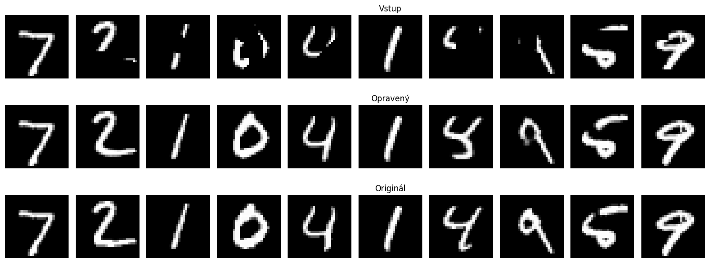
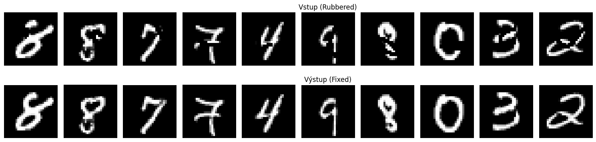
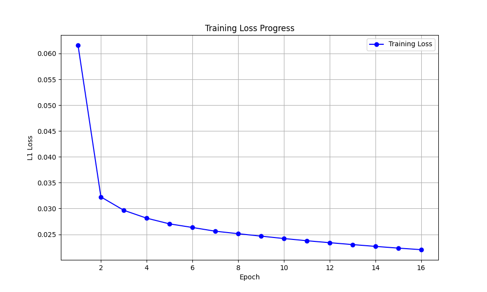
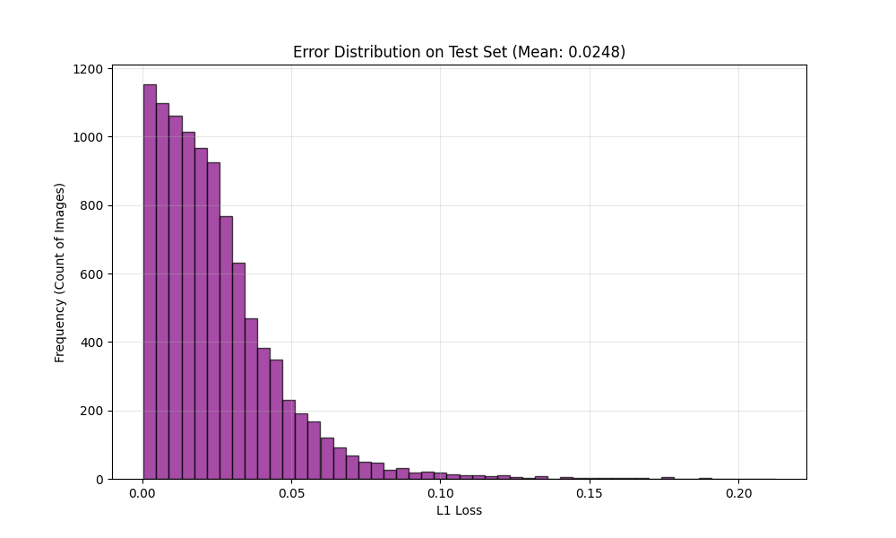

# MNIST Digit Reconstruction

[](https://huggingface.co/spaces/mrtineu/fix-erased-numbers)
[](https://huggingface.co/mrtineu/fix-erased-numbers)

This project is a machine learning solution focused on reconstructing partially "erased" handwritten digits. I created it as my submission for the second home assignment of the [Slovak AI Olympics 2025/26](https://www.ncdtv.sk/olympiada-v-umelej-inteligencii/).

The goal was to build a model that can take a digit image with missing parts (erased by a simulated "rubber") and restore it to its original form.

## Project goal

 The original idea was to:

-   create a program capable of restoring damaged images,
-   implement an autoencoder architecture that understands the structure of digits,
-   and experiment with synthetic data generation to simulate the "damage" process.

## What the project does

The notebook follows this workflow:

1.  **Dataset Preparation**: Downloads the standard MNIST dataset (handwritten digits).
2.  **Eraser Simulation**: Generates a "rubbered" version of the dataset on-the-fly using Bézier curves to simulate random eraser swipes.
3.  **Model Training**: Trains a neural network to map the erased input images to the original clean images.
4.  **Reconstruction**: Applies the trained model to a challenge dataset of 2,000 erased digits (`2000_rubbered_digits.pt`) to generate the fixed versions.

## Dataset

The project uses the **MNIST** foundation dataset. However, because the task is about *reconstruction*, I needed pairs of (damaged, clean) images.

### Synthetic Eraser
To create the training data, I implemented a custom function `erase_with_bezier`. It generates random Bézier curves and draws them in black over the white digits, effectively "erasing" parts of the number. This allowed me to generate an infinite amount of training examples without needed a pre-made dataset of damaged digits.

## Models

### U-Net Autoencoder

I chose to implement a custom **Autoencoder** architecture enhanced with **U-Net** features.

-   **Why U-Net?** Standard autoencoders often lose fine details during the compression (encoding) phase. Since the goal is to reconstruct specific shapes of digits, I added **skip connections** between the encoder and decoder layers. This allows the model to pass high-resolution spatial information directly to the reconstruction phase, resulting in much sharper images.
-   **Architecture details**:
    -   **Encoder**: Reduces the image from 28x28 to a 7x7 latent representation using Convolutional layers and Max Pooling.
    -   **Bottleneck**: A deep layer (128 channels) that captures the abstract "content" of the digit.
    -   **Decoder**: Upsamples the image back to 28x28 using Transpose Convolutions, merging information from the skip connections along the way.

### Pre-trained Weights

The final trained model weights are included in the repository as `repairer.pth`. You can load these directly to skip the training phase and jump straight to inference.

## Results

I utilized **L1 Loss** (Mean Absolute Error) as the primary metric for training. Unlike Mean Squared Error (MSE), L1 Loss encourages the model to produce sharper edges and is less sensitive to outliers, which works well for image reconstruction tasks.

### Visual Performance

The model shows strong performance in filling in the gaps. Even when significant portions of a digit (like the loop of a '6' or the top of a '7') are missing, the model can usually infer the correct digit from the remaining context and reconstruct it plausibly.

#### Test Set Reconstruction

*Top: Input (Rubbered), Middle: Output (Fixed), Bottom: Ground Truth*

#### Challenge Task Results

*Top: Input (Rubbered), Bottom: Output (Fixed) from the challenge dataset*

### Performance Charts

#### Training Loss Progress

*Shows the decrease in L1 Loss over 16 epochs.*

#### Error Distribution

*Histogram of the L1 Loss on the test set, showing most errors are very low.*

## Links

| Resource | URL |
|---|---|
| Live Demo (HuggingFace Space) | https://huggingface.co/spaces/mrtineu/fix-erased-numbers |
| Model on HuggingFace Hub | https://huggingface.co/mrtineu/fix-erased-numbers |

## How to run

The project is designed to run in a Jupyter Notebook environment, specifically **Google Colab** (for GPU support).

1.  **Open in Google Colab**:
    Upload `main_sk.ipynb` (the main notebook, where 'sk' denotes Slovak comments) to Google Colab to take advantage of the free GPU.

2.  **Install dependencies**:
    The notebook cells already contain the necessary `%pip install` commands.
    ```bash
    pip install torch torchvision matplotlib numpy
    ```
3.  **Run the notebook**:
    Run the cells in order.
    *   *Note: The notebook comments are currently in Slovak, as per the competition requirements.*

## Main takeaways

-   I learned how to implement a **U-Net** architecture from scratch in PyTorch.
-   I explored how to **create synthetic datasets** (using math/geometry) to solve problems where training data isn't readily available.
-   I gained experience with **image reconstruction** and understanding latent representations.
-   I learned the hard way that CPUs are too slow for convolution operations—training on a **Google Colab GPU** was essential to finish the project in time.

## Final note

This project was a great way to understand that "repairing" data is just another form of translation, mapping a damaged input to a clean output. While the current model works well for the contest data, future improvements could include using a Generative Adversarial Network (GAN) for even sharper, more realistic results.
